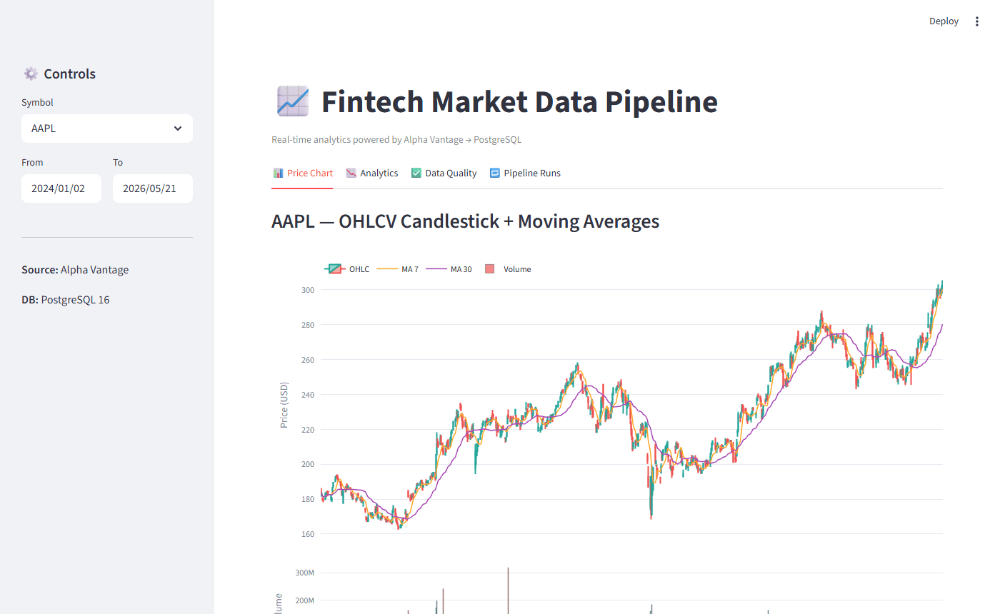
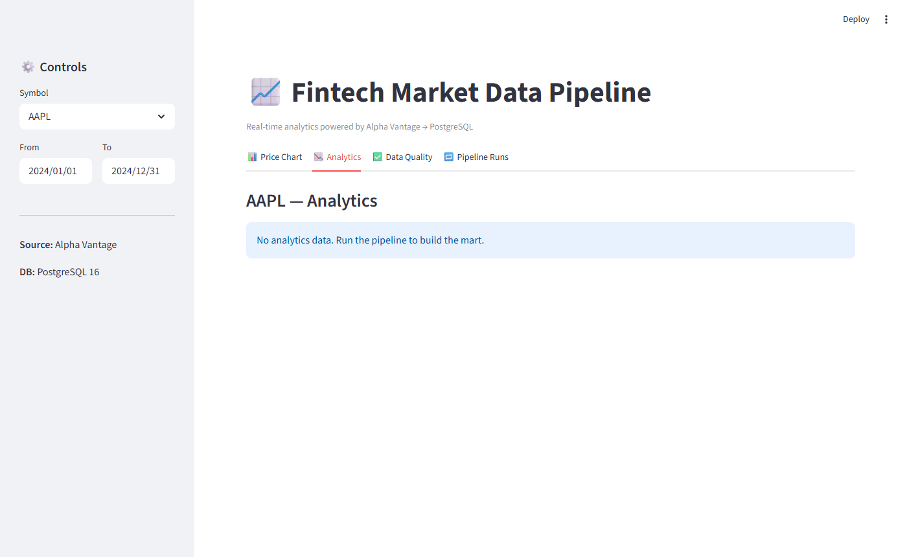
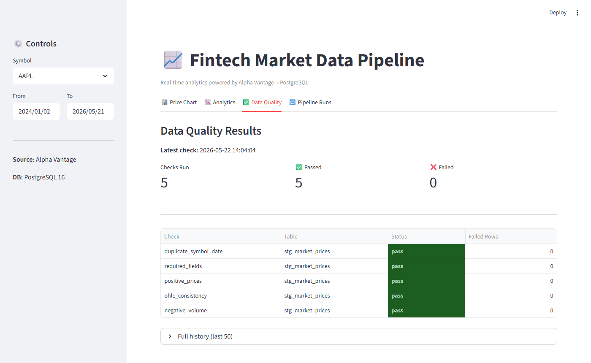

# Fintech Market Data Pipeline


A production-style data engineering pipeline that ingests real market data from **Alpha Vantage**, stores raw and transformed records in **PostgreSQL**, runs automated data quality checks, and exposes an interactive **Streamlit** analytics dashboard.

---

## Dashboard Preview

### Price Chart — Candlestick + Moving Averages


### Analytics — Daily Return, Volatility, Volume Change


### Data Quality — Pass/Fail Report


---

## Architecture

```
Alpha Vantage API
      │
      ▼
┌─────────────────┐
│  Extract Layer  │  AlphaVantageExtractor — TIME_SERIES_DAILY, tenacity retry
└────────┬────────┘
         │ raw JSON payload
         ▼
┌─────────────────┐
│   Raw Storage   │  raw_market_payloads (JSONB) — full audit trail
└────────┬────────┘
         │ normalized PriceRecords
         ▼
┌─────────────────┐
│  Staging Layer  │  stg_market_prices — idempotent upsert ON CONFLICT
└────────┬────────┘
         │
         ▼
┌─────────────────┐
│ Quality Checks  │  5 SQL checks → data_quality_results
└────────┬────────┘
         │ if all pass
         ▼
┌─────────────────┐
│ Analytics Mart  │  mart_daily_symbol_metrics — window functions in SQL
└────────┬────────┘
         │
         ▼
┌─────────────────┐
│   Streamlit     │  4-tab dashboard — candlestick, analytics, quality, runs
└─────────────────┘
```

---

## Database Schema

| Table | Purpose |
|---|---|
| `symbols` | Master list of tracked tickers |
| `pipeline_runs` | One record per execution, tracks status + duration |
| `raw_market_payloads` | Full Alpha Vantage JSON response stored as JSONB |
| `stg_market_prices` | Normalized OHLCV rows, unique on `(symbol_id, trade_date)` |
| `mart_daily_symbol_metrics` | Daily return, MA7, MA30, 30d volatility, volume change |
| `data_quality_results` | Per-check results linked to each pipeline run |

---

## Data Quality Checks

| Check | What it tests |
|---|---|
| `required_fields` | No NULL in symbol_id, trade_date, or any price column |
| `positive_prices` | open/high/low/close all > 0 |
| `ohlc_consistency` | high ≥ low, open/close within high–low band |
| `negative_volume` | volume ≥ 0 |
| `duplicate_symbol_date` | No duplicate (symbol, date) pairs |

Sample output:
```
=======================================================
                 DATA QUALITY REPORT
=======================================================
Check                           Status     Failed
-------------------------------------------------------
required_fields                   PASS          0
positive_prices                   PASS          0
ohlc_consistency                  PASS          0
negative_volume                   PASS          0
duplicate_symbol_date             PASS          0
=======================================================
              ALL CHECKS PASSED
=======================================================
```

---

## Tech Stack

| Area | Tool |
|---|---|
| Language | Python 3.11+ |
| Database | PostgreSQL 16 |
| DB Access | SQLAlchemy 2.0 + psycopg3 |
| Data Processing | pandas |
| Market Data | Alpha Vantage (`TIME_SERIES_DAILY`) |
| Retry Logic | tenacity |
| Config | pydantic-settings |
| Dashboard | Streamlit + Plotly |
| Containerization | Docker Compose |
| Testing | pytest + pytest-cov |
| Linting | ruff + black |

---

## Quick Start

### 1. Clone and configure

```bash
git clone https://github.com/samuelhany-cpu/fintech-market-data-pipeline.git
cd fintech-market-data-pipeline
cp .env.example .env
# Edit .env and set your ALPHAVANTAGE_API_KEY
```

Get a free key at [alphavantage.co](https://www.alphavantage.co/).

### 2. Start PostgreSQL

```bash
docker compose up -d
```

### 3. Install Python dependencies

```bash
pip install -r requirements.txt
```

### 4. Run the pipeline

```bash
python -m src.pipeline --symbols AAPL MSFT TSLA --start 2024-01-01 --end 2024-12-31
```

> **Note:** The free Alpha Vantage tier allows 5 requests/minute.
> The pipeline waits 13 s between symbols — 3 symbols ≈ 45 s total.

### 5. Launch the dashboard

```bash
streamlit run src/dashboard/app.py
# Opens at http://localhost:8501
```

### 6. Run tests

```bash
pytest tests/ -v --cov=src
```

---

## Concurrency Design

The pipeline uses `ThreadPoolExecutor` with up to 3 workers for concurrent per-symbol extraction:

- **Concurrent extraction** — each symbol fetches from the API in its own thread
- **Sequential API pacing** — 13 s delay between `submit()` calls respects the 5 req/min limit
- **Idempotent upserts** — `ON CONFLICT (symbol_id, trade_date) DO UPDATE` prevents duplicate rows even if workers race
- **Short transactions** — extract first, load second; no locks held during HTTP calls

| Mode | Symbols | Approx. Runtime |
|---|---|---|
| Sequential | 3 | ~60 s |
| Concurrent (3 workers) | 3 | ~45 s |

---

## Capture GIFs (optional)

```bash
pip install playwright pillow
playwright install chromium
# Run the pipeline first to populate the DB, then:
python scripts/capture_demo.py
```

GIFs are saved to `docs/`.

---

## Project Structure

```
fintech-market-data-pipeline/
├── src/
│   ├── config/settings.py          # pydantic-settings env config
│   ├── db/engine.py                # SQLAlchemy engine
│   ├── db/init_db.py               # runs SQL migrations on startup
│   ├── extract/alphavantage.py     # Alpha Vantage extractor + retry
│   ├── load/raw_loader.py          # JSONB payload storage
│   ├── load/staging_loader.py      # idempotent OHLCV upsert
│   ├── transform/mart_builder.py   # SQL window function mart
│   ├── quality/runner.py           # 5-check data quality runner
│   ├── pipeline.py                 # CLI orchestrator
│   └── dashboard/app.py            # Streamlit dashboard
├── sql/
│   ├── 001_schema.sql
│   └── 002_indexes.sql
├── tests/
│   ├── test_extractor.py
│   └── test_quality.py
├── scripts/
│   └── capture_demo.py             # Playwright GIF capture
├── docs/                           # GIF output
├── docker-compose.yml
├── requirements.txt
├── Makefile
└── .env.example
```

---

## License

MIT
